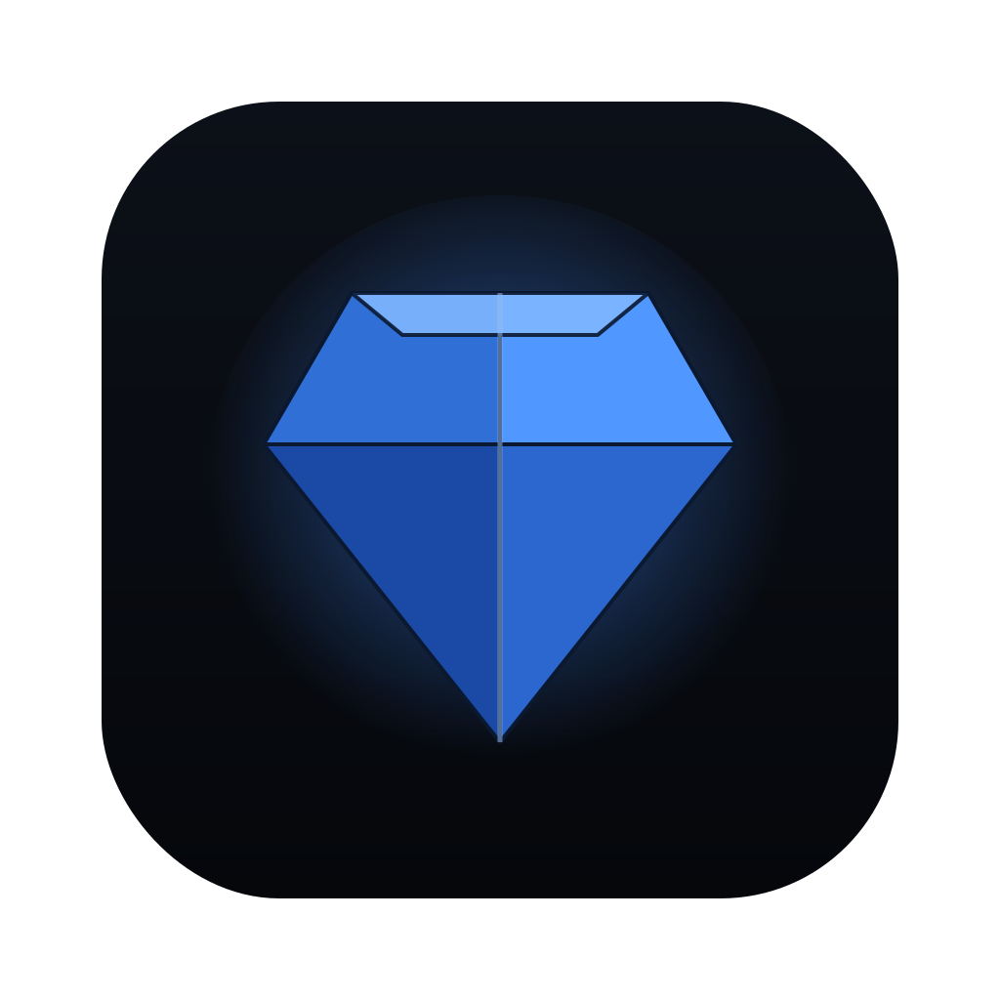
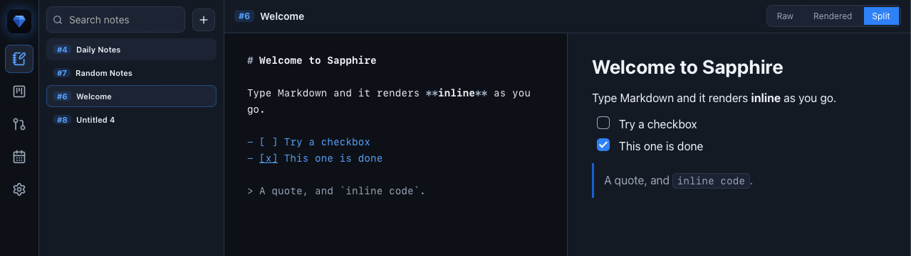
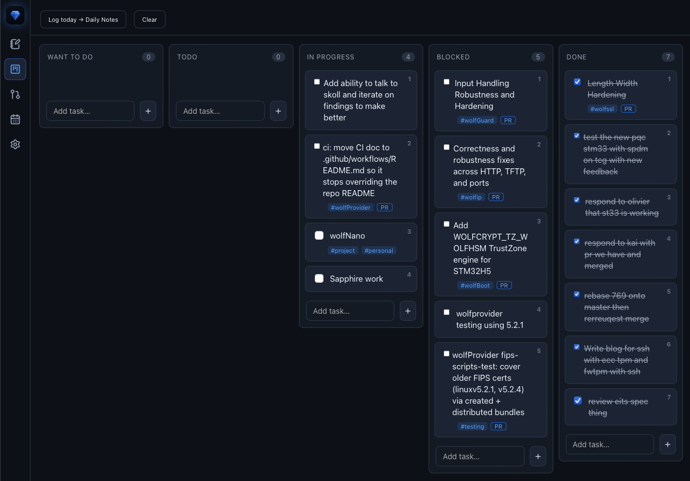
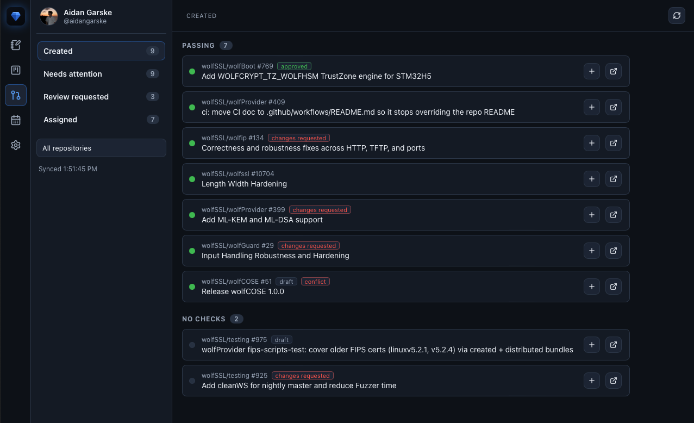

<div align="center">



# Sapphire.md

**A fast, lightweight notes and task app for macOS, built by a developer for developers.**

Write Markdown notes, organize work on a simple task board, and keep an eye on
your GitHub PRs, all in one small native app that opens instantly.

</div>

---

Sapphire is local-first: every note and task is a plain `.md` file on your disk.
No account, no cloud lock-in. The app is just a clean, fast face over your files.

## Screenshots

Notes, split raw and rendered Markdown that formats as you type:



Tasks, a drag-and-drop board backed by `tasks/board.md`:



Pull Requests, your GitHub PRs grouped by what needs you, with CI status:



## Features

- Notes: split raw/rendered Markdown editor, full-text search, numbered notes
  (`#N`), drag-to-reorder, rename, delete.
- Tasks: a board backed by `- [ ]` Markdown with columns (Want To Do, Todo,
  In Progress, Blocked, Done), drag between columns, per-task colors, priority
  numbers, tags, notes, and a per-PR "create task".
- Pull Requests: your GitHub PRs via the `gh` CLI (no token to paste), grouped
  by Created, Needs attention, Review requested, and Assigned, with CI rollup.
- Notifications: native macOS alerts on CI failed/fixed, review requested,
  changes requested, and calendar reminders. Click to open the PR or Meet link.
- Calendar: a day-view timeline of your Google Calendar (read-only).
- Daily log: board activity is appended to a daily note automatically and on demand.

## Install (macOS)

One command installs any missing prerequisites (Xcode CLT, Rust, Node), builds
the app, and copies it to `/Applications`:

```sh
git clone https://github.com/aidangarske/sapphire.git && cd sapphire
npm run setup
```

First launch: right-click **Sapphire** in Applications, then **Open** (it's unsigned).

## Connect your accounts

- GitHub: run `gh auth login` in a terminal (uses the GitHub CLI, nothing to
  paste in the app).
- Google Calendar: see [Docs/CALENDAR-SETUP.md](Docs/CALENDAR-SETUP.md).

## Develop

```sh
npm install
npm run tauri dev     # live-reloading dev window
npm test              # unit tests
npm run app:install   # rebuild release app into /Applications
```

More detail in [Docs/DEVELOPMENT.md](Docs/DEVELOPMENT.md).

## Stack

[Tauri v2](https://tauri.app) (system WebView, small and fast), Preact, TypeScript,
Vite, and CodeMirror 6. Notes and tasks are plain Markdown; tokens are handled by
`gh` and Google OAuth and stored locally.

## Shortcuts

- Cmd+1 to 5: switch tabs. Cmd+N: new note.
- Option+1 to 9 / Option+] [: jump or cycle notes.
- Cmd+A: select all (in the editor).

## License

MIT, Aidan Garske. See [LICENSE](LICENSE).
